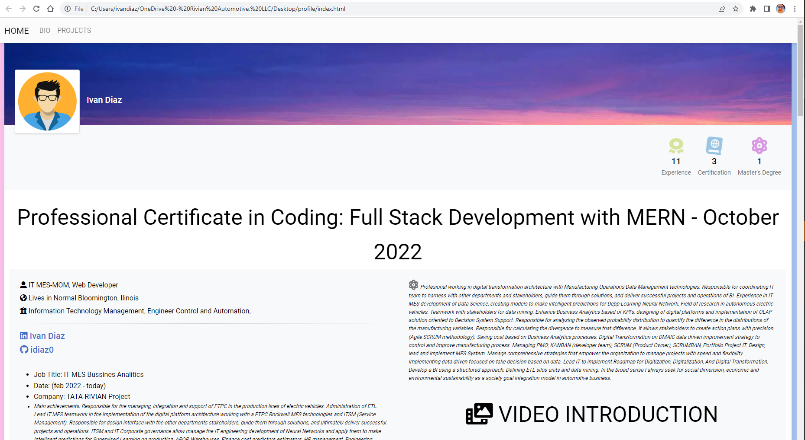
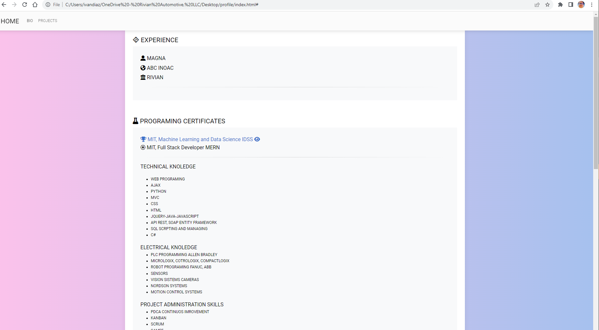
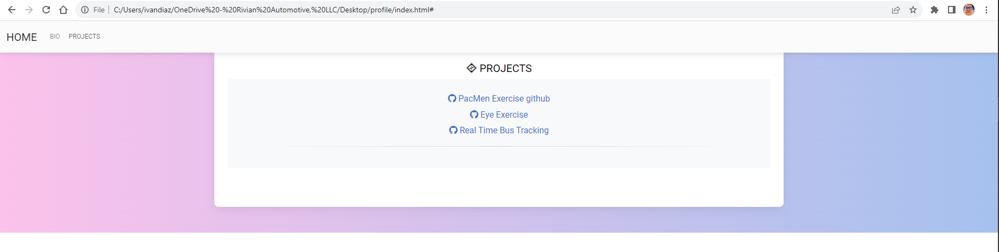

# profile
<h1>IVAN DIAZ</h2>

This app will guide you to undestand my personal profile and my work exerince as well as my achievements.
In my job I'm responsible for analyzing the observed probability distribution to quantify the difference in the distributions of the manufacturing variables. Responsible for calculating the divergence to measure that difference. It allows stakeholders to create action plans with precision (Agile SCRUM methodology).
Saving cost based on Business Analytics processes. Digital Transformation on DMAIC data driven improvement strategy to control and improve manufacturing process. Managing PMO; KANBAN (developer team), SCRUM (Product Owner), SCRUMBAN, Portfolio Project IT. Design, lead and implement MES System. 
Manage comprehensive strategies that empower the organization to manage projects with speed and flexibility. Implementing data driven focused on take decision based on data. Lead IT to implement Roadmap for Digitization, Digitalization, And Digital Transformation. 

</img>
 
</img>
 
</img>
